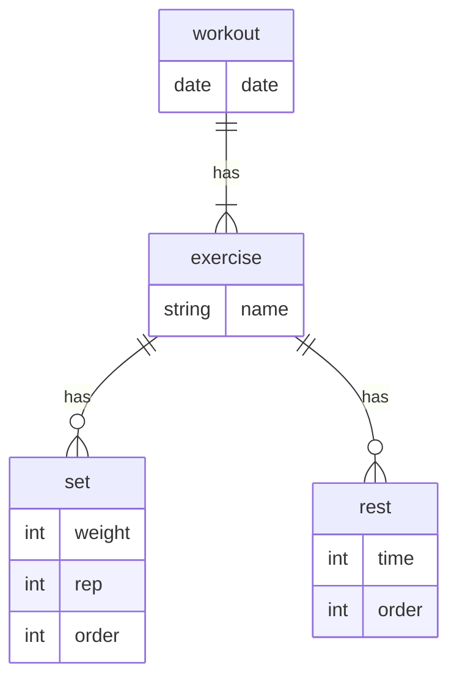

# Prismaに関するメモ
## Prisma CLI
```
npx prisma db push
```
schemaをDBに反映

```
npx prisma db seed
```
([こちら](https://www.prisma.io/docs/orm/prisma-migrate/workflows/seeding)を参考に作成)シーダーを流してくれる

```
npx prisma migrate reset
```
migrationファイルを使ってテーブルを作り直す。レコードを全て削除され、seederがあれば流してくれる。

```
npx prisma migrate dev --name {name}
```
schemaからmigrationファイルを作成

### スキーマ修正した後にやること


## スキーマ定義



