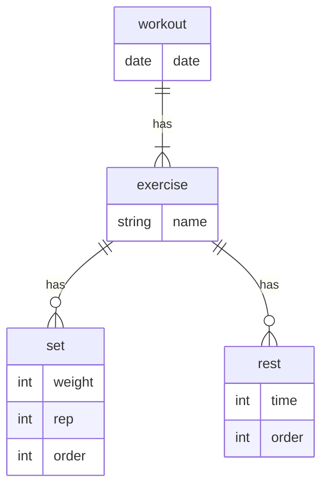

# Prismaに関するメモ
## Prisma CLI
```
npx prisma db push
```
schemaをDBに反映

```
npx prisma db seed
```
([こちら](https://www.prisma.io/docs/orm/prisma-migrate/workflows/seeding)を参考に作成)シーダーを流してくれる

```
npx prisma generate
```
プリズマクライアント生成

```
npx prisma migrate dev --name {name}
```
schemaからmigrationファイルを作成

```
npx prisma migrate reset
```
migrationファイルを使ってテーブルを作り直す。レコードを全て削除され、seederがあれば流してくれる。

### スキーマ修正した後にやること

- format
```
npx prisma format
```

- マイグレーション作成
```
npx prisma migrate dev --name {migration name}
```

- アプリ起動中の場合は再起動
```
ctrl+c
npm run dev
```

- (プリズマクライアント生成)
```
npx prisma generate
```
マイグレーション生成の時にプリズマクラアントも再生成されているっぽい

## スキーマ定義



