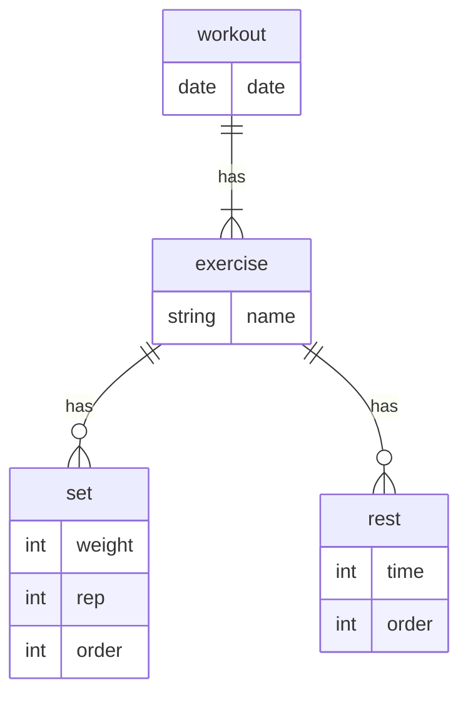

# Prismaに関するメモ
## Prisma CLI
```
npx prisma migrate reset
```
レコードを全て削除する。seederがあれば流してくれる。

```
npx prisma migrate dev --name {name}
```
(timestamp)+{name}でmigrationフォルダを作成(前回からの変更点の差分)

```
npx prisma db seed
```
([こちら](https://www.prisma.io/docs/orm/prisma-migrate/workflows/seeding)を参考に作成)シーダーを流してくれる

```
npx prisma db push
```
スキーマをDBに反映

## スキーマ定義



